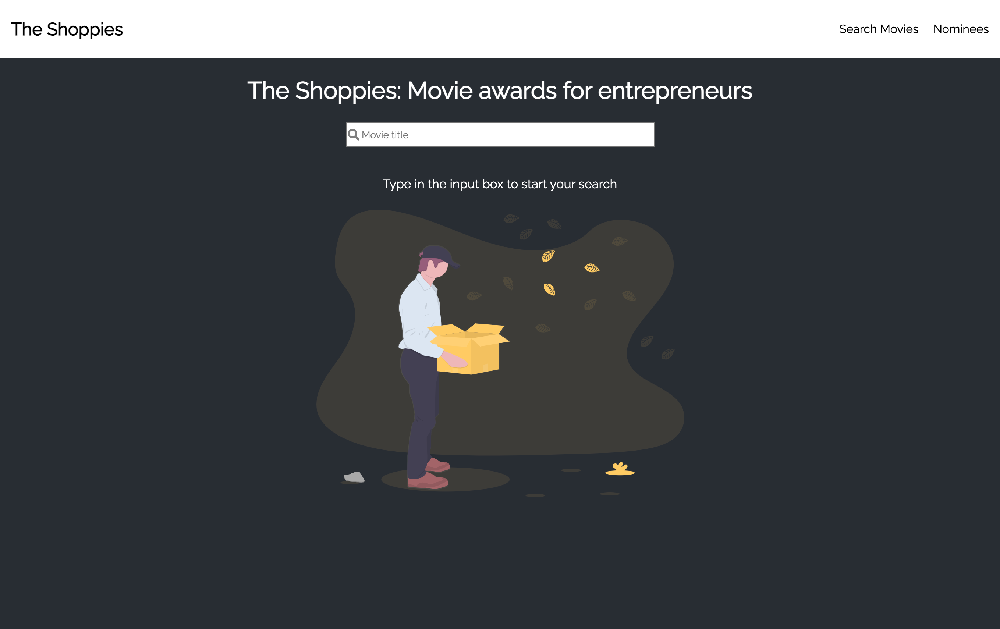
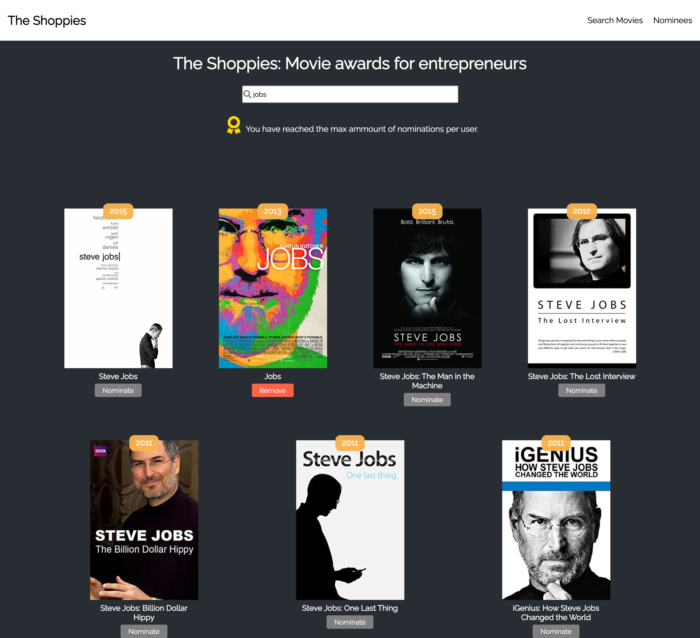
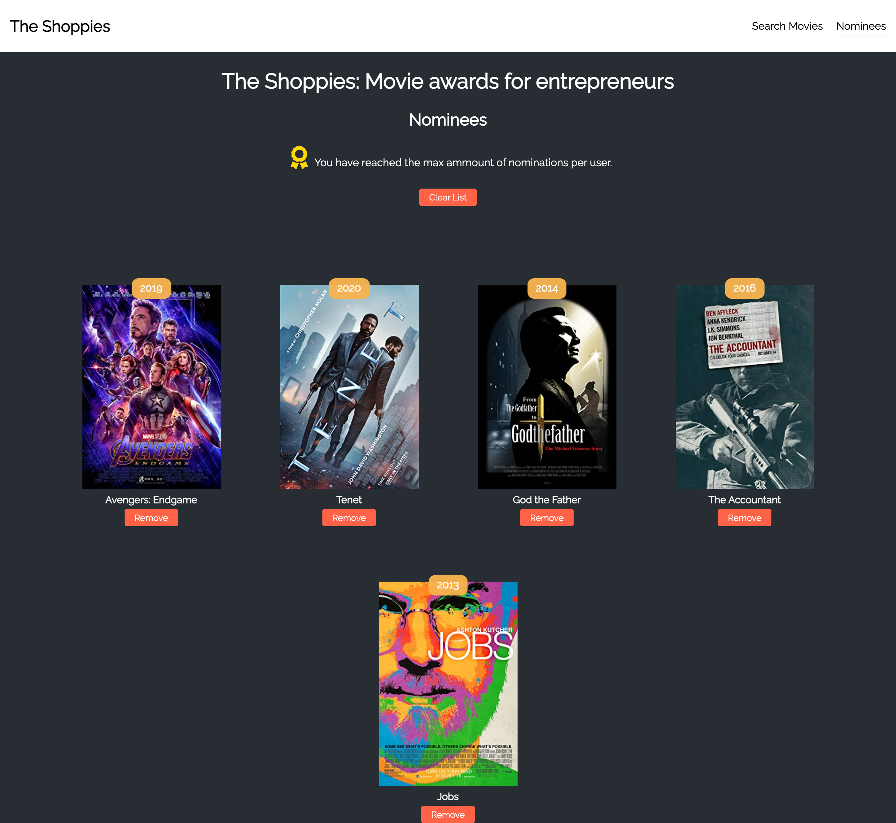
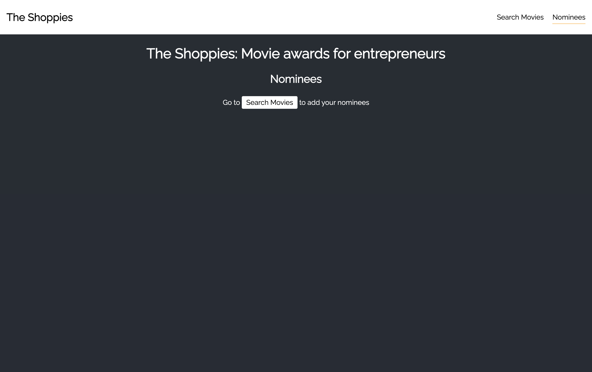

<h1 align="center">
The Shoppies: Movie awards for entrepreneurs</h1>
<h2 align="center">

</h2>

<p align="center">
  


</p>



<h2 align="center"><a  href="https://aneudy-shoppies-awards.netlify.app/">Live Demo</a></h2>

### [Contributions are Welcome](https://github.com/aneudya4/The-Shoppies.git)

## Description

<p align="center">

The Shoppies: Movie awards for entrepreneurs

Shopify has branched out into movie award shows and we need your help. Please build us an app to help manage our movie nominations for the upcoming Shoppies.

The Challenge

We need a webpage that can search OMDB for movies, and allow the user to save their favourite films they feel should be up for nomination. When they've selected 5 nominees they should be notified they're finished.

We'd like a simple to use interface that makes it easy to:
Search OMDB and display the results (movies only)
Add a movie from the search results to our nomination list
View the list of films already nominated

## How to nominate.

### The Shoppies: Movie awards for entrepreneurs:

- **START** Type in the input box to search for a movie you would like to nominate ( max 5 movies per user).
- **Click Nominate** Click the nominate button under the movie card to nominate your movie
- **Notification** When the user reaches 5 nominees will be notified and buttons for nomination will be disabled.
- **Remove** Click the Remove button under the movie card

<p align="center"></p>
<p align="center"></p>

### See all nominees:

- **all Nominees** Click the Nominees section on the navigation bar.
- **Remove all nominees** Click the Clear button on top of the nominees list.
- **Remove** Click the Remove button under the movie card
- **If there are not nominees** User will see a message with a link to the homepage.

<p align="center"></p>
<p align="center"></p>

### Project setup:

```bash
git clone https://github.com/aneudya4/The-Shoppies.git
cd The-Shoppies
npm install
npm run start
open http://localhost:3000
```

## NOTE:

- **issue with fetching** You will need to create your own api key at https://www.omdbapi.com/

## Future scope:

- Adding Authentication
- keep track of the most nominated movies
